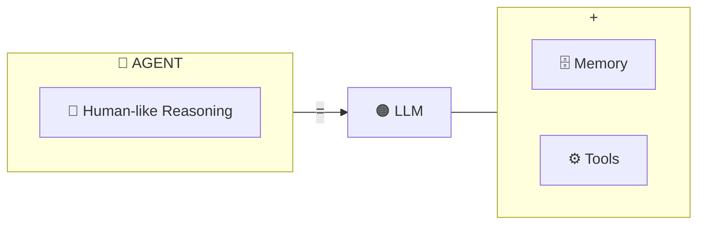
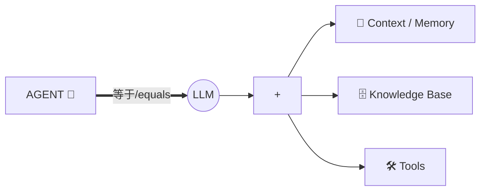
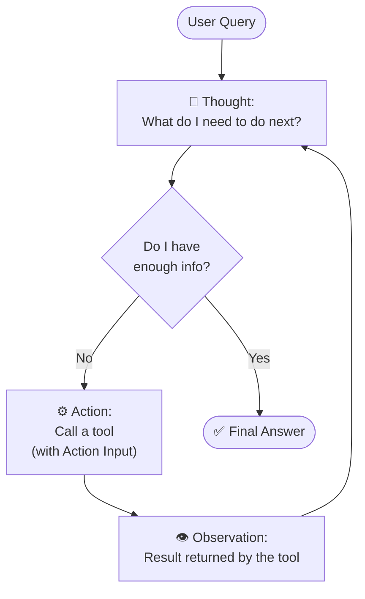
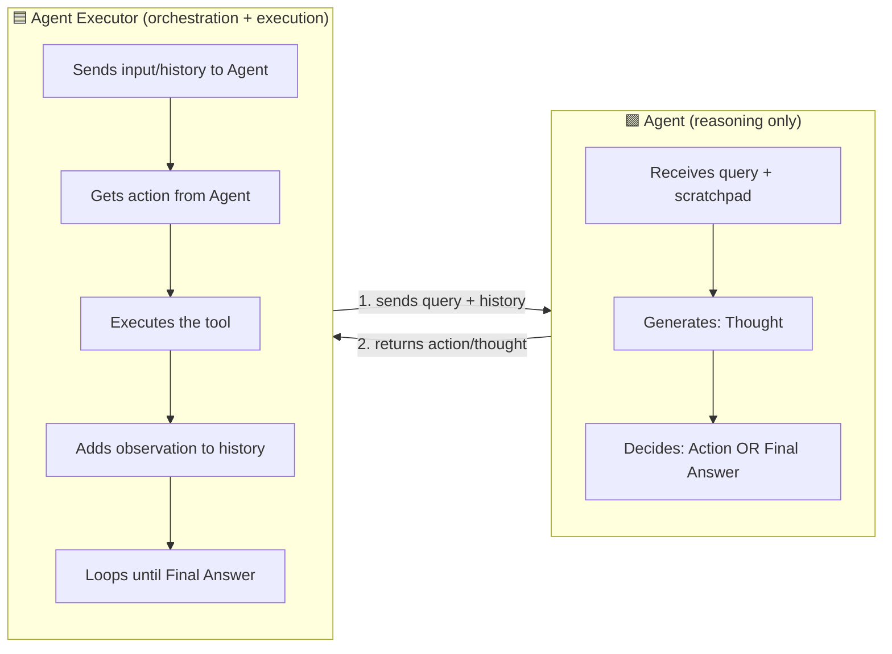
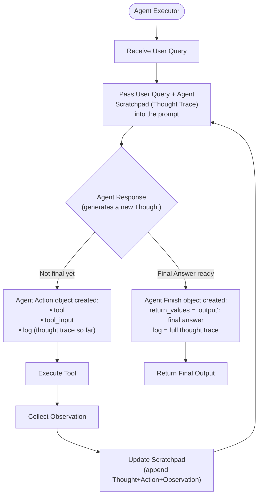

# AI Agents & The ReAct Pattern — A Detailed Guide

---

## 1. What is an AI Agent?

An **AI Agent** is an intelligent system that receives a high-level **goal** from a user and *autonomously* plans, decides, and executes a sequence of actions to achieve it — using external tools, APIs, or knowledge sources along the way. Unlike a plain chatbot that just answers a question, an agent:

- Maintains **context** across multiple steps
- **Reasons** over a multi-step problem instead of answering in one shot
- **Adapts** to new information as it comes in (tool results, errors, etc.)
- **Optimizes** its actions toward the intended outcome

### The Core Equation

At its heart, an agent can be expressed as:

```
AGENT = LLM + MEMORY + TOOLS
```

- **LLM (the "brain")** — does the reasoning, planning, and decision-making
- **Memory** — stores conversation history / context so the agent doesn't lose track of what it has already done
- **Tools** — APIs, calculators, search engines, databases, etc. that let the agent *act* on the world, not just talk about it

### Diagram: The AI Agent Equation



A simpler way to see it, matching the original picture:



**In plain words:** An agent *is* an LLM, but supercharged — given memory so it doesn't forget what it's doing, and given tools so it isn't limited to just generating text; it can actually search the web, call an API, run code, or query a database to get real answers and take real actions.

---

## 2. Characteristics of an AI Agent

There are five defining characteristics that separate an "agent" from a simple prompt-response LLM call:

| Characteristic | Meaning |
|---|---|
| 🎯 **Goal-driven** | You tell the agent *what* you want, not *how* to do it. You don't script the steps — the agent figures those out. |
| 🔧 **Autonomous planning** | The agent breaks the problem down into sub-tasks and sequences them on its own, without a human manually orchestrating each step. |
| 🧠 **Tool-using** | The agent can call APIs, calculators, search tools, databases, code interpreters, etc. to gather information or take action beyond its own internal knowledge. |
| ❓ **Context-aware** | The agent maintains memory across steps — it remembers what it already tried, what it learned, and uses that to inform its next move. |
| 🔄 **Adaptive** | If something changes mid-task (an API fails, no data is returned, a tool errors out), the agent rethinks its plan rather than blindly continuing. |

These five properties working together are what let an agent handle *open-ended, multi-step* tasks — things a single LLM call could never do reliably, because a single call can't observe intermediate results and course-correct.

---

## 3. The ReAct Design Pattern — In Depth

### 3.1 What is ReAct?

**ReAct** stands for **Rea**soning + **Act**ing. It's a prompting/design pattern for AI agents that interleaves:

- **Thought** — the model's internal reasoning about what it needs to do next
- **Action** — a tool call the model decides to make (with some input)
- **Observation** — the result returned by that tool

...in a structured, repeating, multi-step loop — instead of the LLM trying to generate a complete answer in one single shot.

### 3.2 Why ReAct matters

A plain LLM call is "closed-book": it can only use knowledge baked into its weights, and it has to produce the full answer in one pass with no way to verify intermediate facts. ReAct breaks the task into small verifiable steps: the model reasons about *what it doesn't know yet*, goes and gets it via a tool, observes the real result, and *then* decides the next step — grounding each step in real data rather than guessing.

This makes ReAct especially useful for:
- **Multi-step problems** that can't be solved in a single inference pass
- **Tool-augmented tasks** — web search, database lookups, calculators, code execution, etc., where the model needs real-world/real-time data it doesn't already know

### 3.3 The ReAct trace — a worked example

```
Thought: I need to find the capital of France.
Action: search_tool
Action Input: "capital of France"
Observation: Paris

Thought: Now I need the population of Paris.
Action: search_tool
Action Input: "population of Paris"
Observation: 2.1 million

Thought: I now know the final answer.
Final Answer: Paris is the capital of France and has a population of ~2.1 million.
```

Notice the pattern repeats: **Thought → Action → Observation**, over and over, until the model's *Thought* concludes it has enough information — at which point it emits a **Final Answer** instead of another Action.

### 3.4 ReAct as a loop



### 3.5 How ReAct "breaks out" of the loop

Each iteration of the loop, the model generates a new **Thought**. That Thought is checked:

- If the Thought decides *more information is still needed* → the model emits another **Action** (a tool call), the tool executes, an **Observation** comes back, and the loop repeats with this new Observation appended to the running history (the **scratchpad**).
- If the Thought decides *it already has everything it needs* → instead of producing another Action, the model emits a **Final Answer**, and the loop **terminates** — control returns to the user (or calling application) with the final output.

So structurally, the loop is a simple conditional: **while no Final Answer → keep looping through Thought → Action → Observation**; **the moment a Final Answer appears → exit the loop.**

---

## 4. Agent vs. Agent Executor

These two terms are often confused, but they play distinct roles:

### 🟩 Agent
The **Agent** is the *reasoning brain* — usually the LLM plus a prompt template (like ReAct). Its job is purely cognitive:
- Look at the user query + the history of thoughts/actions/observations so far (the "scratchpad")
- **Reason** about what to do next
- **Decide**: either propose another tool call (an *Action*), or declare that it's done (*Final Answer*)

The Agent **never actually executes** a tool itself — it only *decides* what should happen next and outputs that decision as structured data (e.g., "call `search_tool` with input `'population of Paris'`").

### 🟦 Agent Executor
The **AgentExecutor** is the *orchestrator* — the runtime loop that actually drives the whole process forward. It:

1. Sends inputs and previous messages/history to the Agent
2. Gets the next **action** back from the Agent
3. **Executes** that tool with the provided input (the Agent can't do this itself — it has no hands, only a "brain")
4. Adds the tool's **observation** back into the history
5. **Loops again** with the updated history until the Agent says **Final Answer**

### The relationship



**In one line:** the **Agent reasons** (decides *what* to do), while the **AgentExecutor acts** (actually *does* it — calling the tool, capturing the result, and feeding it back). Together, they *implement* the ReAct pattern: the Agent generates the Thought/Action half of ReAct, and the AgentExecutor performs the Action and produces the Observation half — closing the loop.

---

## 5. The Full ReAct Flow Chart — Explained in Depth



### Step-by-step walkthrough

1. **Agent Executor starts** — it's the entry point that kicks off the whole loop.

2. **Receive User Query** — the executor takes in the original question/goal from the user.

3. **Pass User Query + Agent Scratchpad into the prompt** — the executor builds the prompt sent to the LLM. This prompt contains:
   - The original user query
   - The **scratchpad** (a.k.a. the *thought trace*) — a running log of every previous Thought, Action, and Observation from earlier iterations of the loop. On the very first pass, this is empty.

4. **Agent Response (generates a new Thought)** — the LLM reasons over the query + scratchpad and produces a new Thought. This is the decision point of the whole system — a branch:

   - **Branch A — Not done yet:** An **Agent Action** object is created, containing:
     - `tool` — which tool to call (e.g., `search_tool`)
     - `tool_input` — what to pass into that tool (e.g., `"population of Paris"`)
     - `log` — the reasoning trace/thought that led to this decision
     
     This Agent Action is handed off to the **Agent Executor**, which:
     - **Executes the tool** with the given input
     - **Collects the observation** — the raw result the tool returns
     - **Updates the scratchpad** — appends this round's Thought + Action + Observation onto the running history
     - **Loops back** — feeds the now-longer scratchpad back into the prompt, and the cycle repeats (back to step 3)

   - **Branch B — Final answer ready:** Instead of another Action, an **Agent Finish** object is created, containing:
     - `return_values` — typically an `"output"` key holding the final answer text
     - `log` — the complete thought trace that led to this conclusion
     
     This is passed to **Return Final Output**, which ends the loop and hands the final answer back to the user.

### Why this design works

- The **scratchpad/thought trace** is what gives the agent *memory* across iterations — without it, each Thought would have no idea what happened in previous steps.
- The **branch at "Agent Response"** is the actual mechanism of ReAct's "reasoning decides when to stop" behavior — the LLM itself decides, based on its own Thought, whether it needs another tool call or is ready to conclude.
- The **AgentExecutor is the only component that touches the outside world** (calling tools) — this separation of concerns means the Agent (LLM) stays a pure reasoning component, while all side effects/execution are isolated and controlled by the Executor. This makes the system easier to debug, sandbox, and control (e.g., you can log/rate-limit/validate every tool call in one place).

---

## 6. Summary Cheat Sheet

| Concept | One-line definition |
|---|---|
| **AI Agent** | LLM + memory + tools, given a goal, acting autonomously |
| **ReAct** | A pattern where the model interleaves Thought → Action → Observation until it can give a Final Answer |
| **Thought** | The model's internal reasoning about what to do next |
| **Action** | A tool call the model wants made (tool + input) |
| **Observation** | The real-world result returned from executing that tool |
| **Scratchpad / Thought Trace** | The growing history of Thought/Action/Observation pairs, fed back into the prompt each loop |
| **Agent** | The reasoning component — decides what to do next, never executes anything itself |
| **AgentExecutor** | The orchestrator — runs the loop, executes tools, collects observations, updates the scratchpad, and stops the loop on Final Answer |