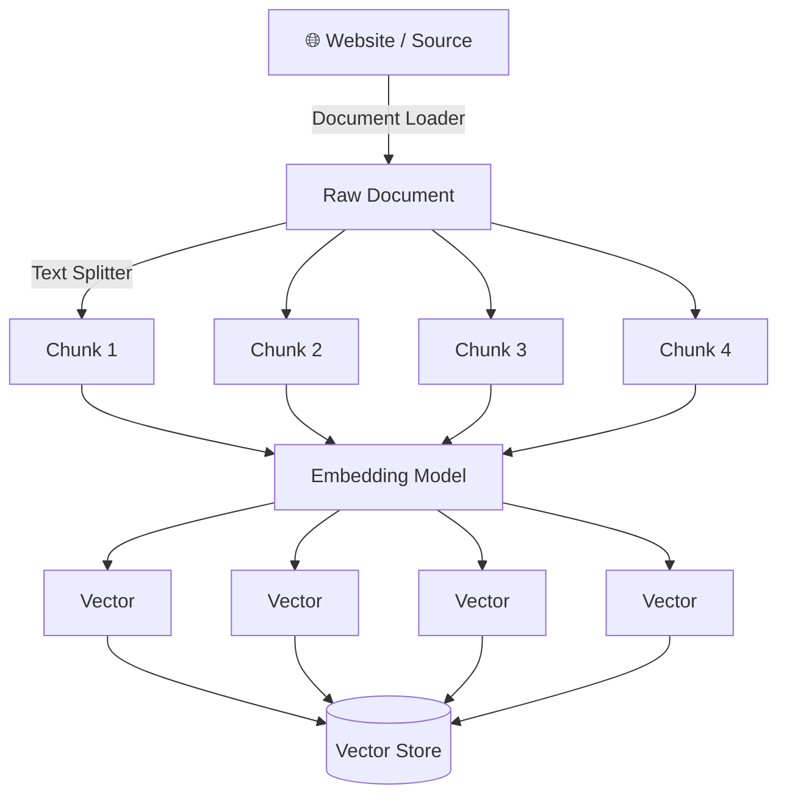
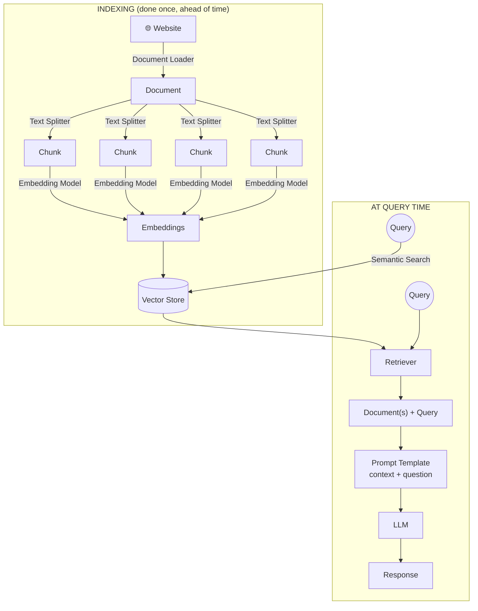

# Retrieval-Augmented Generation (RAG) — Complete Guide

## Table of Contents
- [Starting Point: Query → LLM → Answer](#starting-point-query--llm--answer)
- [What is Parametric Knowledge?](#what-is-parametric-knowledge)
- [The Problems Parametric Knowledge Can't Solve](#the-problems-parametric-knowledge-cant-solve)
- [Solution 1: Fine-Tuning](#solution-1-fine-tuning)
- [Disadvantages of Fine-Tuning](#disadvantages-of-fine-tuning)
- [Solution 2: In-Context Learning](#solution-2-in-context-learning)
- [In-Context Learning as an Emergent Property](#in-context-learning-as-an-emergent-property)
- [Disadvantages of In-Context Learning](#disadvantages-of-in-context-learning)
- [What is RAG?](#what-is-rag)
- [RAG in Practice: A YouTube Chatbot Example](#rag-in-practice-a-youtube-chatbot-example)
- [RAG Technically: The 4 Steps](#rag-technically-the-4-steps)
  - [1. Indexing](#1-indexing)
  - [2. Retrieval](#2-retrieval)
  - [3. Augmentation](#3-augmentation)
  - [4. Generation](#4-generation)
- [Full RAG Architecture](#full-rag-architecture)
- [How RAG Solves the Original Problems](#how-rag-solves-the-original-problems)

---

## Starting Point: Query → LLM → Answer

At the most basic level, using an LLM looks like this:

```
User Query ──────► LLM ──────► Answer
```

You type a question, the LLM processes it, and it gives you back a response. Where does that response actually come from? It comes entirely from what the model **already knows** — baked into it during training. It isn't looking anything up, isn't browsing the internet, isn't querying a database. It's purely generating an answer from what it learned. That "what it already knows" has a name: **parametric knowledge.**

---

## What is Parametric Knowledge?

**Parametric knowledge** is the knowledge an LLM has stored inside its own **parameters** (its weights) as a result of training on massive amounts of text data.

During training, the model isn't memorizing documents verbatim — it's adjusting billions of numerical weights so that, statistically, it learns patterns, facts, relationships, and language structure well enough to generate plausible, useful text. All of that learned information — "Paris is the capital of France," "photosynthesis converts light into energy," how to write Python syntax — is compressed into those weights. When you ask a question, the model isn't retrieving a stored fact from a lookup table; it's generating a response by running your prompt through those trained weights.

Key properties of parametric knowledge:
- It's **static** — frozen at the point training data collection stopped (the "training cutoff"). The model has no built-in way to know about anything that happened after that.
- It's **general-purpose** — trained on broad public data (books, websites, code, etc.), not on your specific private information.
- It's **implicit and probabilistic** — the model doesn't "know" facts with certainty the way a database does; it generates the statistically most likely continuation of text, which is usually correct for well-represented facts but can go wrong.

---

## The Problems Parametric Knowledge Can't Solve

Because all of an LLM's knowledge is parametric — baked in at training time — there are entire categories of questions it fundamentally cannot answer well, no matter how large or capable the model is:

1. **Private data** — The model has never seen your company's internal documents, your personal notes, your product's codebase, or anything not publicly available on the internet at training time. It simply has no parametric knowledge of things it was never trained on.

2. **Recent data** — Anything that happened after the model's training cutoff doesn't exist in its parametric knowledge. Ask it about an event from last week and it either says it doesn't know, or worse —

3. **LLM hallucination** — When the model doesn't actually know something, it doesn't reliably say "I don't know." Because it's fundamentally a next-token predictor trying to generate *plausible* text, it can confidently generate an answer that sounds correct but is entirely fabricated — wrong facts, wrong citations, invented details, stated with full confidence.

So the question becomes: **can we fix this?** Yes — and there are two main approaches, before we get to RAG: **fine-tuning** and **in-context learning.**

---

## Solution 1: Fine-Tuning

**Fine-tuning** is the process of taking a pre-trained LLM and continuing to train it further on a smaller, task/domain-specific dataset — so its weights actually shift to better reflect that new knowledge or behavior.

Fine-tuning typically follows four steps:

| Step | Description |
|---|---|
| **1. Collect data** | A few hundred – few hundred-thousand carefully curated examples (prompts → desired outputs). |
| **2. Choose a method** | Full-parameter FT, LoRA/QLoRA, or parameter-efficient adapters. |
| **3. Train for a few epochs** | You keep the base weights frozen or partially frozen and update only a small subset (LoRA) **or** all weights (full FT). |
| **4. Evaluate & safety-test** | Measure exact-match, factuality, and hallucination rate against held-out data; red-team for safety. |

**Going deeper into each step:**

- **Collecting data** means assembling pairs of (prompt, ideal response) that represent the knowledge or behavior you want the model to internalize — e.g. if you want a model that knows your company's product documentation, you'd construct examples of realistic questions about your product paired with correct, grounded answers.
- **Choosing a method** matters because full-parameter fine-tuning (updating *every* weight in the model) is extremely expensive and requires huge amounts of compute and memory. **LoRA (Low-Rank Adaptation)** and **QLoRA** are popular alternatives that freeze the original model weights and instead train small, injected low-rank matrices alongside them — dramatically reducing the number of trainable parameters (and therefore the compute/memory needed) while still meaningfully shifting model behavior.
- **Training for a few epochs** means running the model over this new dataset repeatedly, using gradient descent to adjust the weights (or the small LoRA subset) so the model's outputs move closer to your desired examples.
- **Evaluating and safety-testing** is critical because fine-tuning can also introduce *new* problems — like the model overfitting to the fine-tuning set, forgetting previously-known general capabilities ("catastrophic forgetting"), or developing new failure modes — so you need to measure factual accuracy and hallucination rate, and actively red-team it before deploying.

**How does this solve the original problems?** By training on your private/recent data, that information literally becomes part of the model's parametric knowledge — the weights themselves now encode it. So a fine-tuned model *can* answer questions about your private documents or newer information, because it's no longer relying purely on its original training data — it has absorbed the new data directly into itself.

---

## Disadvantages of Fine-Tuning

Fine-tuning solves the knowledge-gap problem, but at a real cost:

- **Requires expert AI engineers.** Fine-tuning isn't a plug-and-play operation — you need people who understand data curation, training methodology, hyperparameter tuning, evaluation, and how to avoid problems like catastrophic forgetting or overfitting. This is a specialized skill set, not something a general developer can casually do well.
- **Computationally expensive.** Even parameter-efficient methods like LoRA still require significant GPU resources, and full-parameter fine-tuning of a large model can require enormous multi-GPU clusters. This means real hardware costs, real infrastructure to manage, and real time investment.
- **Not easily updatable.** If your underlying data changes again next week, you don't just edit a document — you have to re-run the entire fine-tuning process. Knowledge baked into weights isn't something you can "patch" quickly.

This expense and complexity is exactly what makes fine-tuning a poor fit for keeping a model up to date with **fast-changing or very large** private data — you'd be re-training constantly.

---

## Solution 2: In-Context Learning

> **In-Context Learning** is a core capability of Large Language Models (LLMs) like GPT-3/4, Claude, and Llama, where the model learns to **solve a task purely by seeing examples in the prompt** — without updating its weights.

This is a fundamentally different approach from fine-tuning. Instead of changing the model's internal weights, you leave the model completely frozen and instead give it the information or examples it needs **directly inside the prompt, at inference time.**

**Example:**

Suppose you want an LLM to classify sentiment, without any fine-tuning. You could just ask it directly — but you can also *show* it what you mean, right inside the prompt:

```
Review: "This movie was fantastic, I loved every minute!" → Positive
Review: "Waste of my time, terrible acting." → Negative
Review: "It was okay, nothing special." → Neutral

Review: "The plot dragged but the visuals were stunning." →
```

The model has never been trained on this exact task or these exact labels. But by simply seeing a handful of labeled examples in the prompt (this is called **few-shot prompting**, a specific application of in-context learning), it picks up the *pattern* — the format, the task, the expected type of output — purely from the examples given, and generates a sensible answer ("Mixed" or "Neutral," most likely) for the final unlabeled review.

This works the same way when the "examples" are actually **facts or documents** rather than labeled examples: if you paste a paragraph of information into the prompt and then ask a question about it, the model can answer accurately based on that pasted text — even though that information was never in its training data — purely because it's now sitting in the prompt as context. This is the exact mechanism RAG relies on, as we'll see below.

**Why this is powerful:**
- **No training required** — zero GPUs, zero weight updates, zero fine-tuning pipeline.
- **Instantly updatable** — change the prompt, and the model's "knowledge" for that request changes immediately. No retraining delay.
- **Cheap and fast** — you're just adding tokens to a request, not running a training job.

---

## In-Context Learning as an Emergent Property

One of the most striking things about in-context learning is that it's considered an **emergent property** of large language models.

This means: smaller/earlier language models **did not reliably have this ability.** You couldn't just show an older, smaller model a few examples in a prompt and expect it to generalize the pattern well. As models were scaled up — more parameters, more training data, more compute — this capability essentially **appeared on its own**, without anyone explicitly designing or training the model specifically to "learn from prompt examples." It wasn't an engineered feature; it emerged naturally as a side effect of scale, once models crossed a certain threshold of size and capability.

This is part of why in-context learning feels almost "magical" — nobody sat down and wrote code that says "if you see examples in the prompt, learn the pattern from them." That behavior simply began showing up as GPT-style models got bigger, and it's now considered one of the defining capabilities that makes modern large LLMs (GPT-3/4, Claude, Llama, etc.) qualitatively different from earlier generations of smaller language models. It's a good illustration of how scaling up model size doesn't just make existing capabilities better — it can produce genuinely new capabilities that weren't present at smaller scale at all.

---

## Disadvantages of In-Context Learning

In-context learning avoids fine-tuning's cost and complexity, but it isn't free of trade-offs:

- **Limited by context window size.** You can only fit so much text into a single prompt. If the information you want the model to reason over (an entire book, a large knowledge base, hours of video transcript) exceeds the context window, you simply cannot paste it all in.
- **Cost scales with context length.** Most LLM APIs charge per token, including the tokens in your prompt. Stuffing huge amounts of context into every single request gets expensive fast, especially at scale.
- **Doesn't persist.** Nothing is "learned" in any lasting sense — the moment the conversation/request ends, that context is gone. Every new request that needs the same background information has to re-supply it.
- **Irrelevant context can hurt quality.** If you dump too much (including irrelevant) information into the prompt "just in case," it can dilute the model's attention and actually degrade answer quality — you need the *right* information in context, not just *more* information.

This last point is the key insight that leads directly into RAG: rather than either (a) baking everything into the model's weights via fine-tuning, or (b) manually stuffing an entire knowledge base into every prompt, what if you could **automatically select and inject only the relevant piece of information into the prompt, for each specific query?** That's exactly what RAG does.

---

## What is RAG?

> **RAG is a way to make a language model (like ChatGPT) smarter by giving it extra information at the time you ask your question.**

```
┌───────────┐
│   Query   │──────┐
└───────────┘      │
                    ▼
              ┌───────────┐        ┌─────────┐        ┌──────────┐
              │  Prompt   │───────►│   LLM   │───────►│ Response │
              └───────────┘        └─────────┘        └──────────┘
                    ▲
┌───────────┐       │
│  Context  │───────┘
└───────────┘
```

Instead of relying purely on the model's parametric knowledge (which is frozen and general-purpose), or manually pasting entire documents into every prompt (which doesn't scale), RAG **combines the user's query with relevant context retrieved on-the-fly**, and feeds *both* into the LLM as a single, assembled prompt. The LLM then answers using this injected context via in-context learning — it isn't retraining, it's just reading the context you handed it and reasoning over it, exactly as it would with any few-shot example.

The crucial difference from plain in-context learning: **you don't manually decide what context to include, and you don't need to fit everything into the prompt.** RAG automatically finds and injects *only* the small, relevant slice of a much larger knowledge base that's actually pertinent to this specific query.

---

## RAG in Practice: A YouTube Chatbot Example

Imagine you want to build a chatbot that lets users ask questions about a specific YouTube video — say, a 2-hour machine learning lecture.

**Without RAG:** you'd have to paste the *entire* 2-hour transcript into the prompt every single time a user asks anything. That's enormous, expensive, likely exceeds the context window, and buries the LLM's attention under mostly-irrelevant text for any single question.

**With RAG:** suppose the user asks *"Can you explain how linear regression works, based on this video?"* The system doesn't send the whole transcript. Instead, it:
1. Searches through the video's transcript (already broken into small chunks and indexed ahead of time) for the specific segment(s) that actually discuss linear regression.
2. Pulls out just that relevant portion — maybe a couple of paragraphs out of a two-hour transcript.
3. Sends *only that relevant chunk*, along with the user's question, to the LLM.

The LLM then answers based on that small, targeted piece of context — accurate, grounded in the actual video content, and without wasting tokens (or the model's attention) on the unrelated hour and a half of the video about, say, decision trees or neural networks. This is the essence of what RAG buys you: **precision** — surfacing exactly the relevant slice of a much larger source, automatically, per query.

---

## RAG Technically: The 4 Steps

Technically, RAG breaks down into four distinct stages:

```
Indexing  →  Retrieval  →  Augmentation  →  Generation
```

### 1. Indexing

Indexing is the **preparation phase** — done ahead of time, before any user ever asks a question. Its job is to take your raw source material and transform it into a searchable form.



Indexing has four sub-steps of its own:

- **Document Loader** — pulls raw content in from wherever it lives (a website, a PDF, a YouTube transcript, a database) and converts it into a standardized `Document` object that the rest of the pipeline can work with.
- **Text Splitter** — breaks that (often very large) document into smaller chunks. This matters for two reasons: embeddings work better on focused, coherent pieces of text rather than huge blocks, and retrieval later on needs to be able to return small, precise sections rather than entire documents.
- **Embedding Model** — converts each individual text chunk into a **dense vector** — a list of numbers that captures the chunk's semantic meaning in a high-dimensional space, positioned such that semantically similar chunks end up close together in that space.
- **Vector Store** — stores all of these chunk-vectors (along with a reference back to their original text) in a specialized database (FAISS, Chroma, Weaviate, etc.) built specifically for fast similarity search over large numbers of vectors.

The entire point of indexing is to do this expensive preprocessing work **once, upfront**, so that at actual query time, you're not re-processing your whole knowledge base — you're just searching an already-prepared index.

### 2. Retrieval

Retrieval is what happens **at query time**. The user's query is converted into a vector using the *same* embedding model used during indexing, and that query vector is compared against all the stored chunk-vectors in the vector store using a **semantic search** — finding the chunks whose vectors are closest (most semantically similar) to the query vector.

This is exactly the retriever component covered in the retrievers guide — it takes a query in, and returns the most relevant `Document` chunks out, without the LLM being involved at all yet. At this stage, all we've done is find "which small pieces of our knowledge base are actually relevant to this specific question" — nothing has been sent to the LLM yet.

### 3. Augmentation

Augmentation is the step where the retrieved chunks and the user's original query get **combined into a single, structured prompt** — this is literally where the "Augmented" in "Retrieval-Augmented Generation" comes from.

A typical augmentation prompt template looks like:

```
"""You are a helpful assistant.
Answer the question ONLY using the provided context.
If the context is insufficient, say you don't know.

{context}

Question: {question}"""
```

The retrieved document chunks get inserted into `{context}`, and the user's original question gets inserted into `{question}`. Notice the explicit instruction to answer **only** from the provided context, and to admit when it's insufficient — this is a deliberate, important design choice: it constrains the LLM to ground its answer in the retrieved information rather than falling back on (potentially outdated or hallucinated) parametric knowledge, which is exactly the failure mode RAG is trying to eliminate in the first place.

### 4. Generation

Generation is the final step: this fully-assembled prompt (system instructions + retrieved context + user question) is sent to the LLM, which then produces the final natural-language **response**.

At this point, the LLM is doing exactly what it's good at — reading the given text and reasoning/summarizing/answering based on it (in-context learning) — but now the context it's reasoning over was automatically, precisely selected for this exact query, rather than being either absent (plain parametric knowledge) or the entire knowledge base dumped in wholesale.

---

## Full RAG Architecture

Putting all four steps together, the complete RAG pipeline looks like this:



Reading this end to end: your source content is loaded, split into chunks, embedded, and stored once (Indexing). Then, for every user query, that same query is embedded and matched against the stored vectors to pull back the relevant chunks (Retrieval). Those chunks are merged with the user's question into a structured prompt (Augmentation). And finally, that prompt is sent to the LLM, which generates the grounded answer (Generation).

---

## How RAG Solves the Original Problems

Going back to where we started — private data, recent data, and hallucination — here's how RAG directly addresses each one, without the downsides of fine-tuning or the limits of plain in-context learning:

- **Private data** ✅ — You index *your own* documents (internal docs, PDFs, transcripts, whatever they are) into the vector store. The LLM's own weights never need to change; it simply gets shown the relevant private content at query time, as context it's allowed to read and reason over.

- **Recent data** ✅ — Since the vector store is just a database you control, you can update, add, or re-index content at any time — today's news, this week's documentation update — with no retraining involved. The LLM answers based on whatever is currently indexed, not what existed at its training cutoff.

- **Hallucination** ✅ (substantially reduced) — Because the prompt explicitly instructs the model to answer *only* from the provided context (and to say when it doesn't know), and because that context is now genuinely relevant and grounded (thanks to retrieval), the model has far less need to "fill in the gaps" with fabricated, confident-sounding guesses. It's reasoning over real, retrieved facts instead of purely generating from its general parametric knowledge.

And crucially, RAG achieves all of this **without the cost and complexity of fine-tuning** (no GPUs, no training pipeline, no specialized ML engineers required to keep it updated) and **without the scaling limits of plain in-context learning** (you're not manually stuffing an entire knowledge base into every prompt — retrieval automatically finds just the relevant slice, no matter how large the overall knowledge base is). This combination of low operational cost, easy updatability, and grounded accuracy is exactly why RAG has become the dominant pattern for connecting LLMs to external or private knowledge.