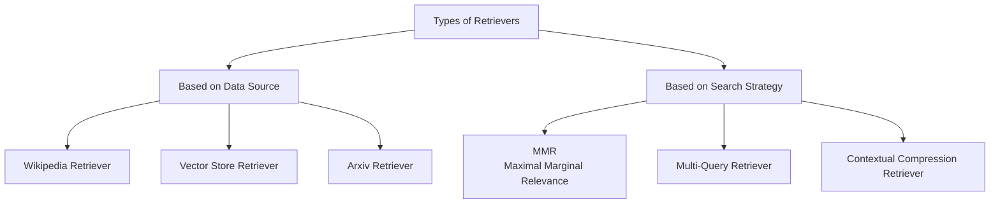
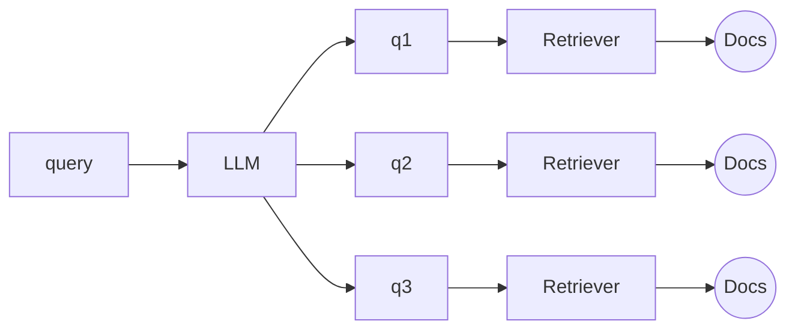

# LangChain Retrievers — Complete Guide

## Table of Contents
- [What are Retrievers?](#what-are-retrievers)
- [Why Retrievers Matter in RAG](#why-retrievers-matter-in-rag)
- [Types of Retrievers](#types-of-retrievers)
  - [Category 1: Based on Data Source](#category-1-based-on-data-source)
  - [Category 2: Based on Search Strategy](#category-2-based-on-search-strategy)
- [Wikipedia Retriever](#wikipedia-retriever)
- [Vector Store Retriever](#vector-store-retriever)
- [Maximal Marginal Relevance (MMR)](#maximal-marginal-relevance-mmr)
- [Multi-Query Retriever](#multi-query-retriever)
- [Contextual Compression Retriever](#contextual-compression-retriever)

---

## What are Retrievers?

> A **retriever** is a component in LangChain that fetches relevant documents from a data source in response to a user's query.

Two important properties to know upfront:
- **There are multiple types of retrievers** — they differ in *where* they pull data from and *how* they decide what's relevant.
- **All retrievers in LangChain are `Runnable`s** — meaning every retriever exposes the same standard `.invoke()` / `.batch()` / `.stream()` interface as every other LangChain component, and can be composed directly into LCEL chains with `|`, just like tools, prompts, and LLMs.

**The basic flow:**

```
┌───────────────┐          ┌─────────────┐          ┌────────────────┐
│               │ ───────► │             │ ───────► │                │
│  Data Source  │          │  Retriever  │          │   Document(s)  │
│               │ ◄─────── │             │          │                │
└───────────────┘          └─────────────┘          └────────────────┘
                                   ▲
                                   │
                              ┌─────────┐
                              │  Query  │
                              └─────────┘
```

A retriever sits between a **query** (what the user is asking) and a **data source** (where the raw information lives — could be a vector store, an API, a document collection). Given a query, it goes and pulls the documents from the data source, and hands back the ones it judges relevant.

At its simplest, you can think of a retriever as a function:

```
query → f(x) → [Document, Document, Document, ...]
```

It takes a query in, and returns a list of `Document` objects out — regardless of what's happening internally (an API call, a similarity search, a database query). That uniform input/output shape is exactly what makes retrievers swappable and composable — you can change what's happening *inside* the box without changing how anything else in your pipeline talks to it.

---

## Why Retrievers Matter in RAG

RAG (Retrieval-Augmented Generation) exists to solve a fundamental limitation of LLMs: an LLM only "knows" what was in its training data, up to its training cutoff. It has no access to your private documents, your company's internal knowledge base, today's news, or anything created after its cutoff — unless you explicitly hand that information to it inside the prompt.

The **retriever is the component that decides what gets handed to the LLM.** This makes it arguably the single most important piece of a RAG pipeline's quality, because:

- **Garbage in, garbage out.** If the retriever fetches irrelevant or low-quality documents, the LLM will generate a bad or hallucinated answer — no matter how good the LLM itself is. The generation step can only reason over what it's given.
- **Context windows are limited.** You can't just dump your entire knowledge base into every prompt. The retriever's job is to be a smart filter — surfacing the *few* most relevant pieces out of potentially millions of documents.
- **Relevance isn't just keyword matching.** A good retriever needs to understand *meaning*, not just exact word overlap — this is why semantic (embedding-based) retrieval is so central to modern RAG, and why more advanced retrieval strategies (covered below — MMR, multi-query, contextual compression) exist at all: plain "find the most similar chunk" retrieval has real, well-known failure modes that these strategies are built to fix.

In short: the LLM in a RAG system is only as good as the context it's fed, and the retriever is entirely responsible for that context. Everything downstream — accuracy, groundedness, avoiding hallucination — depends on getting retrieval right first.

---

## Types of Retrievers

Retrievers can be organized along two independent dimensions — **where they pull data from**, and **how they decide what's relevant**:



This split matters because the two categories answer entirely different questions:
- **Data-source retrievers** answer: *"Where does the raw information physically live, and how do I pull from that specific system?"* (Wikipedia's API? A vector database? Arxiv's paper repository?)
- **Search-strategy retrievers** answer: *"Given that I can search a data source, what's a smarter algorithm for deciding what to return, beyond plain top-k similarity?"* These typically **wrap around** a base retriever (very often a vector store retriever) and add an extra layer of intelligence on top of it — they're not usually a totally separate data source, but a smarter process applied to retrieval itself.

### Category 1: Based on Data Source

These retrievers are defined by *what system* they know how to query.

| Retriever | Data Source |
|---|---|
| **Wikipedia Retriever** | Wikipedia's public API |
| **Vector Store Retriever** | A vector database (FAISS, Chroma, Weaviate, etc.) |
| **Arxiv Retriever** | Arxiv's paper repository |

### Category 2: Based on Search Strategy

These retrievers are defined by *how* they decide what counts as "relevant" — often layered on top of a data-source retriever rather than replacing it.

| Retriever | Strategy |
|---|---|
| **MMR** | Balances relevance with diversity, to avoid redundant results |
| **Multi-Query Retriever** | Generates multiple reworded queries to cover more angles of the user's intent |
| **Contextual Compression Retriever** | Retrieves normally, then strips retrieved documents down to only the relevant parts |

---

## Wikipedia Retriever

A **Wikipedia Retriever** is a retriever that queries the Wikipedia API to fetch relevant content for a given query.

**How it works:**
1. You give it a query (e.g., *"Albert Einstein"*)
2. It sends the query to Wikipedia's API
3. It retrieves the **most relevant articles**
4. It returns them as LangChain `Document` objects

This is a good example of a retriever that requires **zero setup on your end** — no embeddings, no vector store to build. You're delegating both the storage *and* the search logic entirely to Wikipedia's own API; the "retriever" here is essentially a thin, standardized wrapper around that API so it fits into the same `Runnable` interface as every other retriever in your pipeline. It's ideal when your RAG system needs general encyclopedic/world knowledge rather than your own private documents.

---

## Vector Store Retriever

A **Vector Store Retriever** in LangChain is the most common type of retriever — it lets you search and fetch documents from a vector store based on **semantic similarity** using vector embeddings.

**How it works:**
1. You store your documents in a **vector store** (like FAISS, Chroma, Weaviate)
2. Each document is converted into a **dense vector** using an **embedding model**
3. When the user enters a query:
   - It's also turned into a vector
   - The retriever compares the query vector with the stored vectors
   - It retrieves the **top-k most similar ones**

This is the workhorse retriever behind most custom RAG systems — anytime you're building a chatbot over *your own* documents (PDFs, internal docs, a knowledge base), this is almost always the retriever doing the heavy lifting. Its power comes from operating in **embedding space** rather than exact text: it can match a query like *"how do I stay fit?"* against a document that says *"regular exercise improves cardiovascular health,"* even though they share almost no exact words — because their embeddings land close together in vector space.

That said, plain vector-store retrieval (basic top-k similarity search) has known weaknesses, which is exactly why the search-strategy retrievers below exist:
- It can return several near-duplicate chunks instead of diverse, complementary information (→ solved by **MMR**).
- A single query phrasing might miss relevant documents phrased differently (→ solved by **Multi-Query Retriever**).
- Retrieved chunks are often bigger than what's actually relevant, wasting context window space (→ solved by **Contextual Compression Retriever**).

---

## Maximal Marginal Relevance (MMR)

> *"How can we pick results that are not only relevant to the query but also different from each other?"*

**MMR is an information retrieval algorithm designed to reduce redundancy in the retrieved results while maintaining high relevance to the query.**

### Why MMR Retriever?

In a regular similarity search, you may get documents that are:
- All very similar to each other
- Repeating the same info
- Lacking diverse perspectives

This happens because plain top-k similarity search has one goal only: find the *k* vectors closest to the query vector. If your data source happens to contain 5 near-duplicate chunks that are all extremely relevant, a plain retriever will happily return all 5 of them as your "top 5" — even though, from the LLM's perspective, chunks 2 through 5 add almost no new information over chunk 1. You've burned your entire context budget on redundancy instead of coverage.

### What MMR does instead

MMR Retriever avoids that by:
- Picking the **most relevant document** first
- Then picking the next most relevant document **and least similar** to the ones already selected
- And so on...

At each step, MMR is balancing two competing objectives — relevance to the query, and dissimilarity to what's already been picked — instead of optimizing for relevance alone. This is literally where the name comes from: it's maximizing *marginal* relevance, i.e. how much *new* relevant information each additional document adds, not just its raw similarity score in isolation.

Conceptually, MMR scores each candidate document using something like:

```
MMR = λ × Sim(doc, query) − (1 − λ) × max[ Sim(doc, already_selected) ]
```

where `λ` (lambda) controls the trade-off: a higher `λ` weights pure relevance more heavily, a lower `λ` pushes harder for diversity.

### Why this matters (especially in RAG)

This helps especially in RAG pipelines where:
- You want your context window to contain **diverse but still relevant information**
- It's **especially useful when documents are semantically overlapping** — e.g. many chunks of a large document repeating similar phrasing, or multiple sources covering the same topic from slightly different angles.

Without MMR, a RAG system can produce answers that feel narrow or repetitive, because the LLM was only ever shown one narrow slice of the available information, five times over. MMR effectively spends your limited context budget more efficiently — trading a small amount of pure top-1 relevance for much broader coverage of the topic, which usually produces a more complete and well-rounded final answer.

---

## Multi-Query Retriever

Sometimes **a single query might not capture all the ways information is phrased in your documents.**

**Example:**

Query: *"How can I stay healthy?"*

Could mean:
- What should I eat?
- How often should I exercise?
- How can I manage stress?

A simple similarity search might **miss documents** that talk about those things but don't use the word "healthy."

This is the core weakness Multi-Query Retriever targets: a single embedding of a single query phrasing only captures *one point* in semantic space. If the actual answer lives in a document phrased very differently from how the user asked their question, plain similarity search can simply miss it — even though the information is genuinely there and genuinely relevant.

```
     query
       │
       ▼
┌─────────────┐
│    query    │ ─────► ┌──────────────┐
└─────────────┘        │ Vector Store │
                        └──────────────┘
```

**How it works:**
1. **Takes your original query**
2. **Uses an LLM** (e.g., GPT-3.5) **to generate multiple semantically different versions** of that query
3. **Performs retrieval for each sub-query**
4. **Combines and deduplicates the results**



Essentially, this retriever fights the "one phrasing, one point in vector space" problem by using an LLM to generate several *reasonable reformulations* of the same underlying intent — e.g. turning "how can I stay healthy?" into separate queries about diet, exercise, and stress — running retrieval independently for each one, then merging and deduplicating everything into a single result set.

This trades extra compute (multiple LLM-generated queries + multiple retrieval calls instead of one) for meaningfully better recall — it substantially lowers the odds that a genuinely relevant document gets missed just because the user's original wording didn't semantically line up with how that document happened to be written.

---

## Contextual Compression Retriever

The **Contextual Compression Retriever** in LangChain is an advanced retriever that improves retrieval quality by **compressing documents after retrieval** — keeping only the relevant content based on the user's query.

**Example:**

**Query:** *"What is photosynthesis?"*

**Retrieved Document (by a traditional retriever):**
> *"The Grand Canyon is a famous natural site. Photosynthesis is how plants convert light into energy. Many tourists visit every year."*

**❌ Problem:**
- The retriever returns the **entire paragraph**
- Only **one sentence** is actually relevant to the query
- The rest is **irrelevant noise** that wastes context window and may confuse the LLM

**✅ What Contextual Compression Retriever does:**

It takes the same retrieval step as normal, but adds an extra **post-processing stage**: after documents are retrieved, each one is passed through a compressor (usually an LLM, or an embeddings-based filter) that strips it down to only the parts genuinely relevant to the query. For the example above, instead of returning the full three-sentence paragraph, it would return just:

> *"Photosynthesis is how plants convert light into energy."*

**Why this matters:**
- **Less noise reaches the LLM.** Irrelevant sentences sitting in the context window aren't just wasted space — they can actively confuse the LLM or dilute its attention away from the actually-relevant content, increasing the risk of an off-target or lower-quality answer.
- **More efficient use of the context window.** Since irrelevant text is stripped out before it ever reaches the final generation step, you can fit more *actually useful* retrieved content within the same token budget — either by retrieving more documents for the same cost, or simply leaving more room for the LLM's reasoning and the conversation history.
- **Higher answer precision.** Because the LLM sees a tightly focused snippet instead of a whole noisy paragraph, its final answer is more likely to be precisely grounded in the relevant fact, rather than accidentally picking up on or being distracted by nearby irrelevant sentences.

Contextual Compression Retriever is best understood as a **retrieval quality filter layered on top of any base retriever** (commonly a vector store retriever) — it doesn't change *how* documents are found, it changes *how much of what's found* actually gets passed along. It's especially valuable when your source documents are long or your chunks are coarse-grained, since that's exactly when a single retrieved chunk is likely to contain a mix of relevant and irrelevant content.